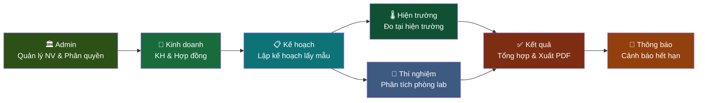
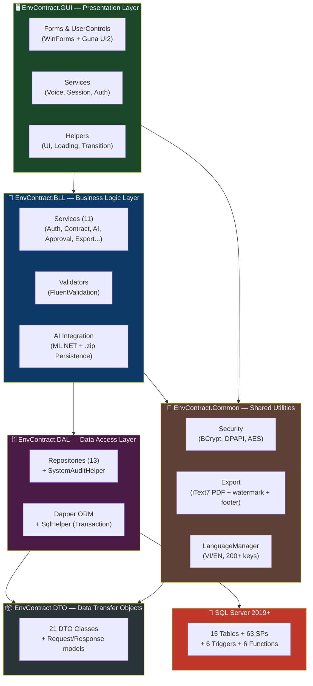
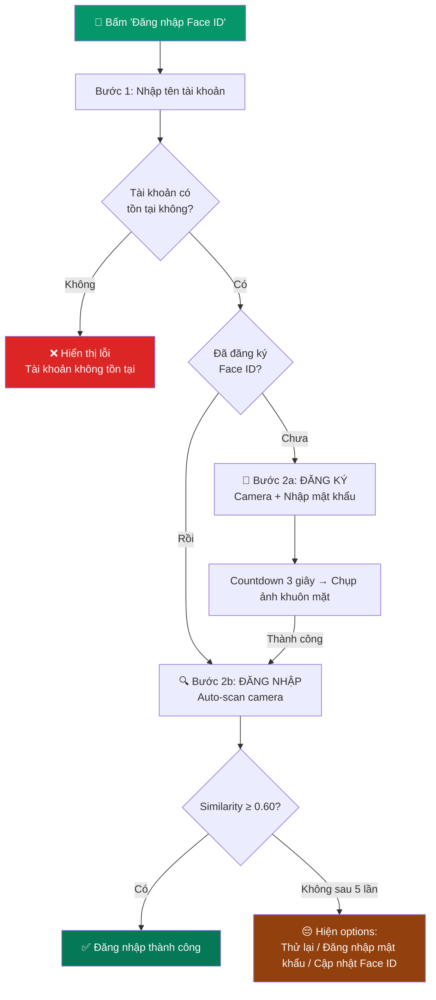
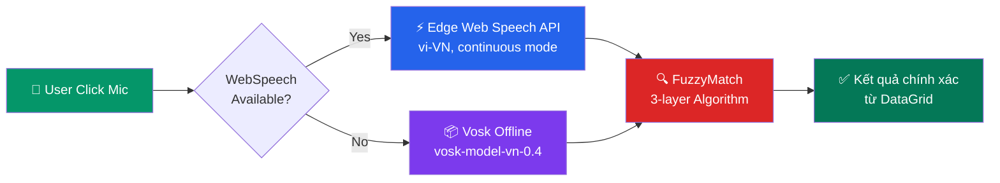
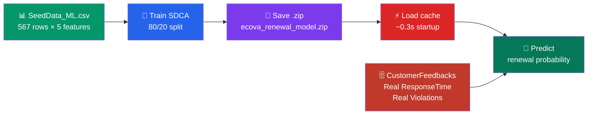
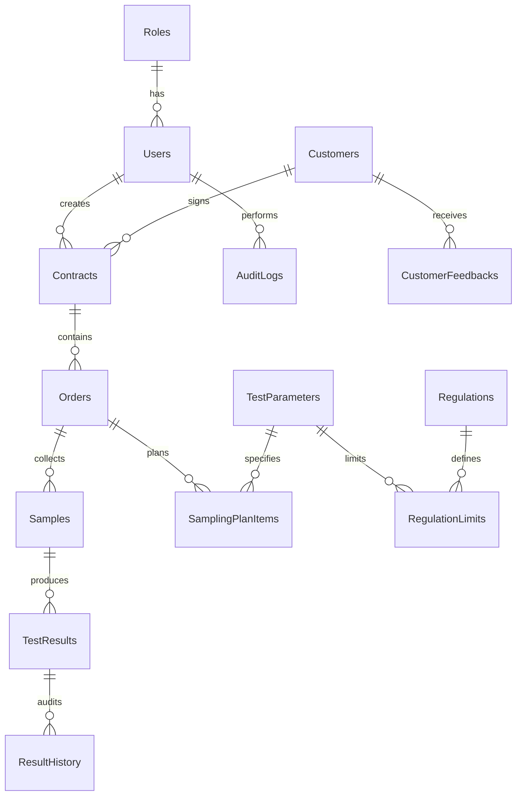

<div align="center">

# 🌿 ECOVA

### Environmental Contract & Observation Verification Application

**Hệ Thống Quản Lý Quan Trắc Môi Trường**

Phần mềm desktop quản lý hợp đồng quan trắc môi trường — tích hợp AI/ML dự đoán tái ký (model persistence `.zip`), Hybrid Voice Search (Edge Web Speech API continuous mode + Vosk offline), Face ID (EmguCV DNN SSD ResNet-10), hệ thống Phân quyền RBAC 7 vai trò, Đa ngôn ngữ VI/EN (200+ keys), Audit Log toàn diện, xuất báo cáo PDF chuẩn mẫu (iText7 + watermark logo + footer), và quy trình xử lý QCVN tự động theo 3 nền mẫu (Không khí / Nước thải / Đất). Hỗ trợ **thêm nền mẫu động** từ UI, **đăng nhập Face ID** 2 bước (nhận diện + đăng ký), và **đóng gói file cài đặt** Setup.exe cho khách hàng.

[](https://dotnet.microsoft.com/)
[](https://www.microsoft.com/sql-server)
[](https://learn.microsoft.com/dotnet/desktop/winforms)
[](https://dotnet.microsoft.com/apps/machinelearning-ai/ml-dotnet)
[](LICENSE)

</div>

---

## 📸 Giao Diện

<details>
<summary><b>🖼️ Xem Ảnh Chụp Màn Hình (Click để mở)</b></summary>

| Màn hình | Mô tả |
|:--------:|:-----:|
|  | **Intro Animation** — Splash screen khởi động |
|  | **Đăng nhập** — Hỗ trợ Face ID & OTP |
|  | **Quên mật khẩu** — Xác minh OTP qua email |
|  | **Dashboard** — 4 KPI + Biểu đồ xu hướng + AI Forecast |
|  | **Phòng Kinh doanh** — Quản lý HĐ & KH + AI dự đoán tái ký |
|  | **Phòng Kế hoạch** — Section cards theo nền mẫu + Thêm nền mẫu động |
|  | **Phòng Hiện trường** — Nhập kết quả đo + cảnh báo QCVN |
|  | **Phòng Thí nghiệm** — Nhập kết quả lab |
|  | **Phòng Kết quả** — Tổng hợp & xuất PDF |
|  | **Quản lý nhân viên** — CRUD + Khóa/Mở tài khoản + Gửi email |
|  | **Thêm nhân viên** — Form thêm NV + tự sinh mã + gửi email |
|  | **Thông báo** — HĐ sắp hết hạn |
|  | **Hồ sơ cá nhân** — Sửa thông tin + đổi mật khẩu + avatar |
|  | **Đa ngôn ngữ** — Chuyển đổi VI ↔ EN real-time |

</details>

---

## ✨ Tính Năng Nổi Bật

<table>
<tr>
<td width="50%">

### 🎙️ Hybrid Voice Search
- **Edge Web Speech API** — `continuous` mode, tiếng Việt **có dấu**
- **Vosk offline fallback** — hoạt động không cần internet
- **Re-entrancy Guard** — chặn click handler async song song
- **Mic Release Delay** — 500ms giữa stop/start giải phóng audio stream
- **Auto-stop sau RESULT** — trả kết quả tức thì (~3s)
- **3-layer Fuzzy Match** — Exact → Word-Overlap → Syllable Jaccard + Levenshtein
- Vietnamese Title Case tự động

</td>
<td width="50%">

### 🤖 AI/ML Prediction
- **ML.NET SDCA Logistic Regression** — dự đoán tái ký HĐ
- **Model persistence** — lưu/tải `.zip` (train 1 lần ~5s, load ~0.3s)
- **Real data** — dùng `CustomerFeedbacks` thực (ResponseTime, vi phạm)
- 567 rows, 47 ngành, **48/52% cân bằng** (Label 1/0)
- Fallback heuristic scoring khi model chưa train

</td>
</tr>
<tr>
<td>

### 🔐 Face ID Authentication
- **EmguCV DNN** — SSD ResNet-10 (`res10_300x300_ssd_iter_140000`)
- **2×2 Grid Histogram** + Bhattacharyya similarity
- GaussianBlur chống bounding-box jitter
- Threshold: 0.60 (cấu hình động)
- **Luồng 2 bước**: Nhập username → Quét camera tự động (iPhone-style)
- **Fallback**: Đăng nhập bằng mật khẩu / Cập nhật Face ID sau 5 lần thất bại

</td>
<td>

### 🔒 Enterprise Security
- **BCrypt** password hashing (work factor 11)
- **DPAPI** encrypted SMTP credentials
- **AES** symmetric encryption helper
- **Brute-force protection** — 5 lần sai → khóa 5 phút
- **Session timeout** — auto-logout 30 phút
- **OTP qua email** — hết hạn 5 phút, one-time use, thread-safe
- **Audit Log** — ghi nhận LOGIN, CREATE_CONTRACT vào DB
- **Password entropy** ~70 bits (NIST SP 800-63B)

</td>
</tr>
<tr>
<td>

### 🌐 Đa Ngôn Ngữ (i18n)
- **Vietnamese ↔ English** — 200+ translation keys
- **Singleton LanguageManager** (lazy-initialized, thread-safe)
- **Persist** lựa chọn vào file `ecova_lang.cfg`
- **Event-driven**: `LanguageChanged` → UI subscribe cập nhật real-time
- **Toggle nhanh**: Nút VI/EN trên sidebar, chuyển đổi tức thì
- Hỗ trợ: Login, Sidebar, Dashboard, Admin, Sales, Planning, Field, Lab, Results, Notification, Profile, Forgot Password, Voice Search, Face ID

</td>
<td>

### 📊 Dashboard & Reporting
- **4 KPI Cards** — Tổng HĐ, Đang HĐ, Sắp hết hạn, QCVN vượt ngưỡng
- **GunaChart** — Spline (rolling 4-quarter) + Doughnut
- **AI Forecast Panel** — Phân tích tổng thể khả năng tái ký
- **iText7 PDF** — xuất phiếu kết quả quan trắc chuẩn mẫu
  - Header: Tên công ty, địa chỉ, điện thoại, email
  - Watermark: `Icon.png` tâm trang, opacity 15%
  - Footer: logo + tên "Ecova" góc trái
  - Hỗ trợ tiếng Việt đầy đủ (Arial TTF + IDENTITY_H)
- **SMTP async** — gửi email thông báo tài khoản

</td>
</tr>
<tr>
<td>

### 🌊 QCVN Compliance
- **3 nền mẫu**: Không khí / Nước thải / Đất
- **23 thông số** QCVN tự động kiểm tra
- **Auto-warning** — tô đỏ cell vượt ngưỡng
- **Thêm nền mẫu động** từ nút UI — ràng buộc không thêm trùng
- Lazy-load & cache theo nền mẫu
- **Cập nhật thông số thông minh** — merge thông số mới vào danh sách cũ, không mất dữ liệu

</td>
<td>

### 🛡️ RBAC — Phân Quyền 7 Vai Trò
- Mỗi role chỉ thấy module của mình
- **Giám đốc** (R02): Chỉ **xem** — không thể thực hiện thao tác ghi/xóa/xuất
- **Quản trị** (R01): Khóa/Mở tài khoản nhân viên (an toàn, không đụng PasswordHash)
- `IsReadOnlyForRole()` — kiểm tra tập trung toàn bộ UI buttons
- Ngăn chặn tự khóa tài khoản chính mình

</td>
</tr>
<tr>
<td colspan="2" align="center">

### 📦 Đóng Gói & Cài Đặt
- **Inno Setup 6** — đóng gói thành 1 file `Setup.exe` chuyên nghiệp
- **1-Click Build**: chạy `Publish_ECOVA.bat` → tự Build Release + Pack installer
- Shortcut ngoài Desktop, Start Menu, tự động gỡ cài đặt (Uninstall)
- `dotnet publish` — Self-contained cho máy khách không cần cài .NET

</td>
</tr>
</table>

---

## 🏢 Quy Trình Quan Trắc Môi Trường (7 Phòng Ban)



| # | Phòng ban | Module | Chức năng chính |
|:-:|:---------:|:------:|:---------------|
| 1 | **Quản trị** | Admin | Quản lý nhân viên (CRUD + Gửi email tài khoản + **Khóa/Mở tài khoản an toàn**) |
| 2 | **Kinh doanh** | Sales | Quản lý khách hàng & hợp đồng, dự đoán tái ký (AI/ML) |
| 3 | **Kế hoạch** | Planning | Lập kế hoạch lấy mẫu theo nền mẫu, **thêm nền mẫu động** (ConstraintMenu), thêm khu vực |
| 4 | **Hiện trường** | Field | Nhập kết quả đo hiện trường (nhiệt độ, độ ẩm, tiếng ồn…) |
| 5 | **Thí nghiệm** | Lab | Nhập kết quả phân tích phòng thí nghiệm (BOD5, COD, TSP…) |
| 6 | **Kết quả** | QA & Director | Tổng hợp kết quả, kiểm tra QCVN, **xuất PDF** từ thanh lọc |
| 7 | **Thông báo** | Notification | Cảnh báo hợp đồng sắp hết hạn |

---

## 📋 Yêu Cầu Hệ Thống

| Thành phần | Yêu cầu |
|:----------:|:--------|
| 🖥️ **OS** | Windows 10/11 (64-bit) |
| ⚙️ **.NET SDK** | 10.0+ (Windows Desktop) |
| 🗄️ **SQL Server** | 2019+ / Express / LocalDB |
| 🌐 **Edge WebView2** | Tự động (Windows 10+) — cho Voice Search |
| 💾 **RAM** | ≥ 4 GB (8 GB khuyến nghị cho AI) |
| 🎤 **Microphone** | Tích hợp hoặc USB (cho Voice Search) |
| 📷 **Camera** | Webcam tích hợp hoặc USB (cho Face ID) |
| 💿 **Dung lượng** | ≥ 500 MB (Vosk model tải lần đầu ~50 MB) |

---

## ⚙️ Cài Đặt & Chạy

### 1️⃣ Khởi tạo Database

Mở **SQL Server Management Studio (SSMS)**, kết nối tới server, và chạy **lần lượt theo thứ tự**:

```sql
-- Bước 1: Tạo database, schema, 15 bảng, indexes, AuditLog SPs
Database\EcovaDB_Init.sql

-- Bước 2: Tạo 6 triggers + 6 functions + 63 stored procedures (bao gồm sp_ToggleEmployeeActive)
Database\EcovaDB_Procedures.sql

-- Bước 3: Seed dữ liệu mẫu (roles, users, khách hàng, hợp đồng, QCVN, kết quả)
Database\EcovaDB_Seed_Full.sql
```

> ⚠️ **Quan trọng:** Chạy đúng thứ tự `Init → Procedures → Seed`. Tất cả 3 file đều **idempotent** — có thể re-run an toàn mà không bị lỗi trùng dữ liệu.

### 2️⃣ Cấu hình Connection String

Mở `EnvContract.GUI\appsettings.json` và cập nhật server name:

```json
{
  "ConnectionStrings": {
    "Default": "Server=TÊN_SERVER\\SQLEXPRESS;Database=ECOVA;Trusted_Connection=True;TrustServerCertificate=True;Connect Timeout=5;"
  }
}
```

### 3️⃣ Cấu hình SMTP (Email thông báo)

Mật khẩu email được mã hóa bằng **Windows DPAPI** — không lưu plaintext.

```powershell
# Tạo mã hóa mật khẩu SMTP
Add-Type -AssemblyName System.Security
$entropy = [System.Text.Encoding]::UTF8.GetBytes("ECOVA_DPAPI_2025")
$plain   = [System.Text.Encoding]::UTF8.GetBytes("YOUR_APP_PASSWORD")
$enc     = [Security.Cryptography.ProtectedData]::Protect($plain, $entropy, 'CurrentUser')
[Convert]::ToBase64String($enc)
```

Dán kết quả vào trường `Password` trong `SmtpSettings`, đặt `"PasswordEncrypted": true`.

### 4️⃣ Build & Chạy (Debug)

```powershell
# Build toàn bộ solution
dotnet build

# Chạy ứng dụng
dotnet run --project EnvContract.GUI
```

> **📌 Lần đầu khởi chạy:**
> - **Voice Search:** Click nút Mic → khởi tạo Edge Web Speech API (không cần tải model). Nếu Edge không khả dụng → fallback sang Vosk, hiện form tải model (~50 MB).
> - **AI Model:** Lần đầu tự train từ `Data/SeedData_ML.csv` (~5 giây), lưu cache `Data/ecova_renewal_model.zip`. Lần sau load từ cache (~0.3 giây).
> - **Ngôn ngữ:** Mặc định tiếng Việt. Nhấn nút VI/EN trên sidebar để chuyển đổi. Lựa chọn được lưu trong `ecova_lang.cfg`.

### 5️⃣ Đóng Gói File Cài Đặt (Cho Khách Hàng)

Để tạo file `ECOVA_Setup_v1.0.exe` phân phối cho khách hàng:

**Bước 1:** Tải và cài đặt [Inno Setup 6](https://jrsoftware.org/isdl.php) (miễn phí, chỉ cài 1 lần).

**Bước 2:** Chạy file `Publish_ECOVA.bat` ở thư mục gốc → tự động Build Release + đóng gói:

```
ECOVA_Setup_v1.0.exe  ←  nằm trong thư mục Installer/
```

File cài đặt bao gồm: shortcut Desktop/Start Menu, tự động gỡ cài đặt (Programs & Features).

### 6️⃣ Tài Khoản Mặc Định

| Vai trò | Username | Password | Role | Ghi chú |
|:-------:|:--------:|:--------:|:----:|:--------|
| 🛡️ Quản trị viên | `admin` | `admin` | R01 | Full quyền, quản lý nhân viên |
| 👔 Giám đốc | `director` | `admin` | R02 | **Chỉ xem** — không ghi/xóa/xuất |
| 💼 P. Kinh doanh | `tuyethan` | `admin` | R03 | Quản lý KH & HĐ |
| 💼 P. Kinh doanh | `minhkhoa` | `admin` | R03 | |
| 🌡️ P. Hiện trường | `baolongnv` | `admin` | R04 | Nhập kết quả đo |
| 🌡️ P. Hiện trường | `duchuy` | `admin` | R04 | |
| 🔬 P. Thí nghiệm | `thuha` | `admin` | R05 | Nhập kết quả lab |
| 🔬 P. Thí nghiệm | `anhtuan` | `admin` | R05 | |
| 📋 P. Kế hoạch | `huonggiang` | `admin` | R06 | Lập kế hoạch lấy mẫu |
| 📋 P. Kế hoạch | `minhtung` | `admin` | R06 | |
| ✅ P. Kết quả | `thanhloannv` | `admin` | R07 | Duyệt & xuất báo cáo |
| ✅ P. Kết quả | `hoangnam` | `admin` | R07 | |

> ⚠️ **Bảo mật:** Đổi mật khẩu ngay sau lần đăng nhập đầu tiên!

---

## 🏗️ Kiến Trúc Hệ Thống

### N-Tier Architecture (137 source files)



### Design Patterns

| Pattern | Triển khai |
|:-------:|:----------|
| **Dependency Injection** | `Microsoft.Extensions.DependencyInjection` — đăng ký đầy đủ ở `Program.cs` |
| **SPA Shell** | `MainForm` — sidebar + `pnlContent` load `UserControl` động |
| **Repository** | 13 repository implementations qua interface — tách biệt DAL/BLL |
| **Singleton** | `AppConfig.cs` (lazy), `LanguageManager` (lazy), SMTP mailer, `AppState.CurrentUser` |
| **Strategy** | Hybrid Voice: WebSpeech → Vosk fallback; FuzzyMatch 3-layer |
| **Observer** | `OnPartialResult` event (Vosk streaming), `LanguageChanged` event (i18n) |
| **Validator** | `FluentValidation AbstractValidator<T>` — `ContractValidator`, `ResultValidator` |
| **Re-entrancy Guard** | `VoiceButtonState` enum (`Idle/Recording/Processing`) — chặn WinForms async click handler chạy song song (Phase 5) |

---

## 🗂️ Cấu Trúc Project

```
ECOVA/                                         # 137 source files (.cs)
├── 📄 ECOVA.slnx                              # Solution file (.NET 10)
├── 📄 Directory.Build.props                   # Shared build properties
├── 📄 ECOVA_Setup.iss                         # Inno Setup 6 — kịch bản đóng gói cài đặt
├── 📄 Publish_ECOVA.bat                       # Script 1-Click: Build Release → Pack installer
├── 📄 .gitignore                              # Git ignore (bin, obj, appsettings, ML model, logs)
│
├── 📦 EnvContract.DTO/                        # Data Transfer Objects
│   ├── Entities/                              #   21 DTO classes (Contract, Customer, User, …)
│   ├── Requests/                              #   Request models (input binding)
│   └── Responses/                             #   Response models (output binding)
│
├── 🗄️ EnvContract.DAL/                        # Data Access Layer (Dapper + SQL Server)
│   ├── Database/
│   │   ├── DbConnectionFactory.cs             #   Connection string management
│   │   └── SqlHelper.cs                       #   Dapper wrapper (Query, Execute, Transaction)
│   ├── Interfaces/                            #   13 Repository interfaces (+ ToggleActiveAsync)
│   └── Repositories/                          #   13 repos + SystemAuditHelper (fire-and-forget)
│       ├── AuditLogRepository.cs
│       ├── ContractRepository.cs
│       ├── CustomerRepository.cs
│       ├── EmployeeRepository.cs              #   ⭐ ToggleActiveAsync (sp_ToggleEmployeeActive)
│       ├── OrderRepository.cs
│       ├── ResultAuditLogRepository.cs
│       ├── SampleRepository.cs
│       ├── SamplingPlanRepository.cs
│       ├── StandardParameterRepository.cs
│       ├── SystemAuditHelper.cs               #   Fire-and-forget AuditLog
│       ├── TestingResultRepository.cs
│       ├── TestResultRepository.cs
│       └── UserRepository.cs
│
├── 🧠 EnvContract.BLL/                        # Business Logic Layer
│   ├── Interfaces/                            #   IAuthService, IApprovalService, IExportService…
│   ├── Validators/                            #   FluentValidation (ContractValidator, ResultValidator)
│   └── Services/                              #   11 services
│       ├── AiIntegrationService.cs            #   ML.NET SDCA + .zip model persistence
│       ├── ApprovalService.cs
│       ├── AuthService.cs                     #   BCrypt, OTP, brute-force, session
│       ├── ContractService.cs                 #   AI score injection on GetById
│       ├── CustomerService.cs
│       ├── EmployeeService.cs                 #   ⭐ ToggleActiveAsync — khóa/mở TK an toàn
│       ├── ExportService.cs                   #   PDF export delegate to PdfExportHelper
│       ├── NotificationService.cs
│       ├── PlanningService.cs                 #   CreateSamplingAreaAsync (Thêm nền mẫu)
│       ├── TestingService.cs
│       └── UserBLL.cs
│
├── 🔧 EnvContract.Common/                     # Shared Utilities
│   ├── AppState.cs                            #   Global session state (CurrentUser, etc.)
│   ├── LanguageManager.cs                     #   ⭐ i18n Singleton (VI/EN, 200+ keys, persist)
│   ├── Constants/                             #   AppConstants, Colors, Errors, StatusEnums
│   ├── Exceptions/                            #   Custom exception types
│   └── Helpers/
│       ├── PdfExportHelper.cs                 #   ⭐ iText7 PDF — 1 trang A4, watermark Icon.png,
│       │                                      #      footer logo, Arial TTF tiếng Việt, ràng buộc 1 page
│       ├── SecurityHelper.cs                  #   BCrypt hashing + password generation
│       ├── DpapiHelper.cs                     #   DPAPI encrypt/decrypt (Windows)
│       ├── AesHelper.cs                       #   AES symmetric encryption
│       ├── EncryptionHelper.cs                #   Encryption utility wrapper
│       └── EmailSmtpHelper.cs                 #   SMTP async email sending
│
├── 🖥️ EnvContract.GUI/                        # WinForms UI (.NET 10 Windows)
│   ├── Program.cs                             #   DI container + Serilog + startup
│   ├── appsettings.json                       #   Config (DB, SMTP, FaceID, Session)
│   ├── Forms/
│   │   ├── Auth/
│   │   │   ├── Login.cs                       #     Đăng nhập chính (Password)
│   │   │   ├── Login.FaceID.cs                #     ⭐ Face ID — 2 bước: username → camera tự động
│   │   │   ├── FaceIdManager.cs               #     EmguCV DNN + 2×2 Grid Histogram
│   │   │   └── ForgotPasswordForm.cs
│   │   ├── Main/                              #     MainForm (SPA shell, sidebar, i18n toggle)
│   │   ├── Admin/
│   │   │   ├── EmployeeAddEditForm.cs         #     CRUD nhân viên (Add/Edit, tự sinh mã NV, gửi email)
│   │   │   └── SendMailForm.cs                #     Gửi thông báo email hàng loạt
│   │   ├── Planning/
│   │   │   ├── AddAreaForm.cs                 #     Dialog thêm khu vực lấy mẫu
│   │   │   └── AddParameterForm.cs            #     ⭐ Merge thông số mới + cũ (fix mất dữ liệu)
│   │   ├── Profile/                           #     Edit profile + đổi mật khẩu + avatar
│   │   └── Components/                        #     Camera, Voice, Barcode
│   ├── UserControls/
│   │   ├── Dashboards/                        #     KPI cards + GunaChart + AI Forecast
│   │   ├── Sales/                             #     Customer + Contract management + AI score
│   │   ├── Planning/
│   │   │   ├── SampleConfigUC.cs              #     ⭐ Thêm nền mẫu động (ConstraintMenu 3 lựa chọn)
│   │   │   └── ParameterConfigUC.cs
│   │   ├── FieldAndLab/                       #     Field results + Lab results
│   │   ├── Admin/
│   │   │   └── EmployeeManagementUC.cs        #     ⭐ Khóa/Mở TK dùng ToggleActiveAsync (an toàn)
│   │   ├── QAAndDirector/
│   │   │   └── DirectorApprovalUC.cs          #     ⭐ Xuất PDF từ thanh lọc (Anchor=Right)
│   │   └── Notification/                      #     Expiry alerts
│   ├── Services/
│   │   ├── WebSpeechService.cs                #     ⭐ Edge Web Speech API (vi-VN, continuous mode)
│   │   ├── VoiceSearchService.cs              #     Hybrid engine + Vosk fallback + FuzzyMatch
│   │   ├── VoiceModelManager.cs               #     Auto-download Vosk model
│   │   ├── LoginThrottleService.cs            #     Brute-force protection (5 lần/5 phút)
│   │   └── SessionTimeoutService.cs           #     Auto-logout 30 phút
│   ├── Helpers/
│   │   ├── VoiceSearchHelper.cs               #     ⭐ Re-entrancy guard + mic release delay
│   │   ├── UIConstants.cs                     #     Colors, fonts, padding
│   │   ├── FormTransitionHelper.cs            #     Animation (fade/slide)
│   │   ├── LoadingOverlay.cs                  #     Spinner overlay
│   │   └── PopupOverlayHelper.cs              #     Modal popup
│   ├── deploy.prototxt                        #     DNN face detection config
│   └── res10_300x300_ssd_iter_140000.caffemodel  # Pre-trained face detector (~10 MB)
│
├── 🗃️ Database/
│   ├── EcovaDB_Init.sql                       # Schema — 15 bảng + indexes + AuditLog SPs (idempotent)
│   ├── EcovaDB_Procedures.sql                 # 6 triggers + 6 functions + 63 SPs (idempotent)
│   └── EcovaDB_Seed_Full.sql                  # Seed — 40 HĐ, ~80 đợt, ~800 kết quả, 10 feedback
│
├── 📊 Data/
│   ├── SeedData_ML.csv                        # ML.NET dataset (567 rows, 47 ngành, 48/52 balanced)
│   └── ecova_renewal_model.zip                # AI model cache (auto-generated, ignored by git)
│
└── 🎨 assets/
    └── images/                                # Logo, icons (Icon.png dùng watermark PDF), screenshots
```

---

## 🌊 Giao Diện Phân Cấp Nền Mẫu

### Phòng Kế hoạch — Thêm Nền Mẫu Động

Ba phòng Kế hoạch, Hiện trường, Thí nghiệm đều hiển thị khu vực theo **section cards phân nhóm theo nền mẫu**:

```
┌─────────────────────────────────────────────────────────────────────────────┐
│  🔽 Nền mẫu: [Tất cả ▾]   Phân công: [Tất cả ▾]          [Thêm nền mẫu]  │
├─────────────────────────────────────────────────────────────────────────────┤
│                                                                             │
│  🌬 KHÔNG KHÍ                                              [1 khu vực]     │
│    ① Khu vực ống khói chính                    [Thêm thông số] [X]         │
│       [Bảng thông số: Tên | Đơn vị | Phòng ban | QCVN | Thao tác]         │
│    [➕ Thêm khu vực]                                                        │
│                                                                             │
│  💧 NƯỚC THẢI                                              [1 khu vực]     │
│    ① Bể lắng thứ cấp B                        [Thêm thông số] [X]         │
│       [Bảng thông số: ...]                                                  │
│                                                                             │
└─────────────────────────────────────────────────────────────────────────────┘
```

**Hành vi nút "Thêm nền mẫu":**

| Điều kiện | Hành vi |
|:----------|:--------|
| Click vào nút | Hiện ContextMenuStrip với 3 lựa chọn |
| Nền mẫu **chưa có** | ✅ Enabled — có thể chọn để thêm |
| Nền mẫu **đã tồn tại** | ❌ Disabled — font xám + tooltip giải thích |
| **Cả 3** nền mẫu đã có | 🔔 MessageBox cảnh báo "Tất cả đã được thêm" |
| Sau khi chọn | Tạo khu vực đầu tiên + Reload danh sách |

**Hành vi nút "Thêm thông số" — (ĐÃ FIX):**

| Điều kiện | Hành vi |
|:----------|:--------|
| Mở popup thêm thông số | Merge danh sách DB + thông số **đang có trên lưới** |
| Thông số custom chưa có trong DB | ✅ Vẫn hiển thị + được check sẵn |
| Xác nhận | Chỉ cập nhật delta — **không xóa** thông số cũ |

### Phòng Kết quả — Xuất PDF Từ Thanh Lọc

```
┌─────────────────────────────────────────────────────────────────────────────┐
│  🔽 Thông số: [Tất cả ▾]     Vị trí: [Tất cả ▾]              [Xuất file]  │
├─────────────────────────────────────────────────────────────────────────────┤
│                                                                             │
│  [Bảng kết quả kiểm thử với màu cảnh báo QCVN]                            │
│                                                                             │
└─────────────────────────────────────────────────────────────────────────────┘
```

---

## 🔐 Face ID — Luồng Hoạt Động



---

## 🛡️ RBAC — Phân Quyền Chi Tiết

| Role | Module Được Phép | Hạn Chế |
|:----:|:-----------------|:---------|
| R01 Admin | Toàn bộ hệ thống | — |
| R02 Giám đốc | **Chỉ xem** tất cả module | Không thể Thêm/Sửa/Xóa/Xuất file |
| R03 Kinh doanh | Sales (KH + HĐ) | Chỉ xem các module khác |
| R04 Hiện trường | FieldAndLab (nhập kết quả đo) | Chỉ xem các module khác |
| R05 Thí nghiệm | FieldAndLab (nhập kết quả lab) | Chỉ xem các module khác |
| R06 Kế hoạch | Planning (lập kế hoạch) | Chỉ xem các module khác |
| R07 Kết quả | QAAndDirector (duyệt + xuất PDF) | Chỉ xem các module khác |

> **Giám đốc trong hệ thống** chỉ có thể **xem** (chức năng phê duyệt thực hiện bằng chữ ký tay bên ngoài hệ thống). Toàn bộ button Thêm/Sửa/Xóa/Cập nhật/Xuất file đều bị disabled.

---

## 📄 PDF Export — Chi Tiết Kỹ Thuật

`PdfExportHelper.cs` (`EnvContract.Common.Helpers`) tạo **Phiếu Kết Quả Kiểm Thử** chuẩn mẫu ECOVA in 1 trang A4:

```
┌─────────────────────────────────────────────────────────┐
│          CÔNG TY CỔ PHẦN TẬP ĐOÀN FEC (xanh #31572C)  │
│   19 Nguyễn Hữu Thọ, Phường Tân Hưng, TP Hồ Chí Minh  │
│   ĐT: 0914210113                 Email: sales@fec.com.vn │
│ ─────────────────────────────────────────────────────── │
│           PHIẾU KẾT QUẢ KIỂM THỬ (17pt bold)           │
│                                    Số: HD-0001MVD        │
│                                                          │
│ I. Thông tin chung                                       │
│  ┌─────────────────┬─────────────────────────────────┐  │
│  │ Tên khách hàng  │ Công ty CP Bao Bì Xanh          │  │
│  │ Địa chỉ         │                                 │  │
│  │ Địa điểm QT     │ Trụ sở chính                   │  │
│  │ Loại mẫu        │ Không khí xung quanh            │  │
│  │ Vị trí QT       │                                 │  │
│  │ Ngày quan trắc  │ 27/03/2026                      │  │
│  │ Ngày phân tích  │ 10/04/2026                      │  │
│  │ Ngày trả KQ     │ 17/04/2026                      │  │
│  └─────────────────┴─────────────────────────────────┘  │
│                                                          │
│ II. Kết quả                                              │
│  ┌───┬──────────┬─────┬──────────────┬────┬────┬──────┐ │
│  │STT│ Thông số │ ĐV  │ PP phân tích │ K1 │ K2 │ QCVN │ │
│  ├───┼──────────┼─────┼──────────────┼────┼────┼──────┤ │
│  │ 1 │ Ánh sáng │ lx  │              │307 │314 │300-5k│ │
│  │...│   ...    │ ... │     ...      │... │... │ ...  │ │
│  └───┴──────────┴─────┴──────────────┴────┴────┴──────┘ │
│                          [Watermark Icon.png – 15% opacity│
│ ─────────────────────────────────────────────────────── │
│ [🌿 logo 18×18]  Ecova                                  │
└─────────────────────────────────────────────────────────┘
```

| Thành phần | Kỹ thuật |
|:-----------|:---------|
| **Font tiếng Việt** | Arial TTF từ Windows Fonts + `IDENTITY_H` + `PREFER_EMBEDDED` |
| **Watermark** | `Icon.png` qua `ImageDataFactory`, `SetOpacity(0.15f)`, 220×220pt, tâm trang |
| **Footer** | `Icon.png` 18×18pt + Text "Ecova" (xanh `DarkGreen2`, 10pt Bold) |
| **Layout** | Margin 28/36/42/36, font 9–14pt, row min-height 20pt → đảm bảo 1 trang |
| **Tìm Icon.png** | Tìm lần lượt 3 đường dẫn (`bin/`, `../../../`, `../../../../assets/images/`) |

---

## 🎙️ Hybrid Voice Search — Chi Tiết Kỹ Thuật

> **Kiến trúc 2 tầng**: Ưu tiên **Edge Web Speech API** (online, tiếng Việt có dấu, chính xác cao) → Fallback xuống **Vosk** (offline, không cần internet) khi Edge không khả dụng.



### Voice Search Flow (Edge Web Speech API)

```
Click 1: Init WebView2 → Tooltip hướng dẫn → Background warm-up (fire-and-forget)
Click 2: Cancel warm-up → 500ms mic release delay → Recording (continuous mode)
         → User nói → RESULT (~3s) → Auto-stop → Kết quả hiện trên textbox
Click N: Khi recording: Cancel gracefully (re-entrancy guard chặn start mới)
```

### Kiến trúc chống lỗi Voice Search

| Cơ chế | Mục đích |
|:-------|:---------|
| **Re-entrancy Guard** (`isRunning`) | Chặn WinForms async click handler song song — tránh vòng lặp cancel-restart vô tận |
| **Mic Release Delay** (500ms) | Chrome audio stream cần 300-500ms release mic sau `recognition.stop()` |
| **Continuous Mode** | `recognition.continuous = true` — engine không tự dừng khi có khoảng im ngắn |
| **InterimResults** | `recognition.interimResults = true` — engine xử lý audio liên tục |
| **Auto-stop sau RESULT** | `recognition.stop()` sau khi nhận final result — trả kết quả tức thì |
| **No-speech retry** (2 lần) | Mic có thể cần 2-3 lần warm-up cycle sau khi release từ warm-up |
| **Session ID pattern** | Mỗi `startListening()` tăng `currentSession` — handler cũ bị vô hiệu hóa |
| **SemaphoreSlim guard** | `WaitAsync(1500)` chống concurrent access microphone (singleton service) |

### FuzzyMatch Algorithm (3 lớp)

| Lớp | Thuật toán | Ví dụ |
|:---:|:----------|:------|
| 1️⃣ | **Exact / Contains** (case-insensitive, có & không dấu) | `"dệt may thái bình"` → `"Dệt may Thái Bình"` ✓ |
| 2️⃣ | **Word-Overlap** (≥ 60% từ khớp) | `"cong ty vinamilk"` → `"Công ty cổ phần Vinamilk"` ✓ |
| 3️⃣ | **Syllable Jaccard + Levenshtein** (≥ 55%, bỏ dấu thanh) | `"hồ thị tuyết hương"` → `"Hồ Thị Tuyết Hân"` ✓ |
| 🔄 | **Vietnamese TitleCase fallback** (khi không có context) | `"nguyễn trung nguyên"` → `"Nguyễn Trung Nguyên"` |

---

## 🤖 AI/ML — Dự Đoán Tái Ký Hợp Đồng



| Feature | Nguồn | Mô tả |
|:--------|:------|:------|
| `TotalContractValue` | `Contracts.TotalContractValue` | Giá trị hợp đồng (VNĐ) |
| `IndustryType` | `Contracts.IndustryType` | Ngành nghề (47 loại) — OneHotEncoded |
| `ResponseTime` | `CustomerFeedbacks.ResponseTime` | Thời gian phản hồi trung bình (giờ) |
| `PreviousViolations` | `CustomerFeedbacks.PreviousViolations` | Số lần vi phạm |
| `Label` | Training data | 1 = tái ký, 0 = không tái ký |

| Metric | Giá trị |
|:------:|:-------:|
| **Dataset** | 567 rows, 47 ngành, **48% / 52%** (cân bằng) |
| **Algorithm** | SDCA Logistic Regression (binary classification) |
| **Split** | 80% train / 20% test (seed: 42) |
| **Lần đầu** | Train + save `.zip` (~5s) |
| **Lần sau** | Load `.zip` (~0.3s) |

---

## 🗄️ Database Schema

### Sơ đồ quan hệ



### Chi tiết bảng (15 bảng)

| Bảng | Mô tả | Records |
|:----:|:------|:-------:|
| `Roles` | 7 vai trò phòng ban (R01–R07) | 7 |
| `Users` | Tài khoản + Avatar + Face ID embedding + IsActive | 12 |
| `Customers` | Khách hàng / doanh nghiệp (MST, đại diện) | 10 |
| `CustomerFeedbacks` | Đánh giá KH → AI features (ResponseTime, Violations) | 10 |
| `Contracts` | Hợp đồng dịch vụ quan trắc | 40 |
| `Orders` | Đợt quan trắc + EnvironmentType (Không khí / Nước thải / Đất) | ~80 |
| `Regulations` | QCVN (3 loại: Không khí, Nước thải, Đất) | 3 |
| `TestParameters` | 23 thông số đo (Field + Lab) + hỗ trợ Custom params | 23+ |
| `RegulationLimits` | Giới hạn QCVN cho từng thông số | 23 |
| `SamplingPlanItems` | Kế hoạch lấy mẫu × thông số × phòng ban | ~280 |
| `Samples` | Mẫu (barcode, vị trí, thời tiết) | ~80 |
| `TestResults` | Kết quả phân tích (giá trị, IsWarning) | ~800 |
| `ResultHistory` | Audit trail kết quả (trigger tự động) | — |
| `EmailQueue` | Hàng đợi email thông báo | — |
| `AuditLogs` | **Audit log toàn hệ thống** (LOGIN, CRUD) | — |

### Programmability Objects

| Loại | Số lượng | Ghi chú |
|:----:|:--------:|:--------|
| **Triggers** | 6 | AutoWarning, AuditHistory, 4× UpdatedAt |
| **Scalar Functions** | 4 | IsResultExceedingLimit, GetContractStatus, CompletionPercent, FormatContractID |
| **Table-Valued Functions** | 2 | GetParametersByRegulation, GetTestResultsWithLimits |
| **Stored Procedures** | **63** | Core (6) + Queries (13) + CRUD (42) + AuditLog (2) (+sp_ToggleEmployeeActive) |
| **Performance Indexes** | 14 | Filtered, composite, covering indexes |

---

## 📋 Audit Trail

### Audit Kết Quả (tự động — trigger)

- ✅ Lưu kết quả → trigger `trg_TestResults_AuditHistory` tự ghi vào `ResultHistory`
- 🛡️ **Change guard** — so sánh `ResultValue` cũ/mới, bỏ qua nếu không thay đổi
- 📜 Lưu: `OldValue`, `NewValue`, `ChangedBy`, `ChangedAt`

### Audit Hệ Thống (system-wide — `AuditLogs`)

- 🔐 **LOGIN** — ghi khi đăng nhập thành công (Username + MachineName)
- 📝 **CREATE_CONTRACT** — ghi khi tạo hợp đồng mới
- 🔥 **Fire-and-forget** — `SystemAuditHelper.LogAsync()` không block business logic
- ⚡ **Error-safe** — lỗi ghi audit chỉ log warning, không crash ứng dụng

---

## 📦 NuGet Packages

<details>
<summary><b>EnvContract.GUI — Presentation Layer</b></summary>

| Package | Version | Mục đích |
|:--------|:-------:|:---------|
| `Guna.UI2.WinForms` | 2.0.4.7 | UI components (Button, Panel, ComboBox…) |
| `Guna.Charts.WinForms` | 1.1.0 | Biểu đồ Spline, Doughnut (Dashboard) |
| `Emgu.CV` + `.Bitmap` + `.runtime.windows` | 4.12.0.5764 | Face ID — OpenCV DNN wrapper |
| `Microsoft.Web.WebView2` | 1.0.2792.45 | Edge Web Speech API (Hybrid Voice Search) |
| `Vosk` | 0.3.38 | Vosk offline speech recognition (fallback) |
| `NAudio` | 2.2.1 | Thu âm microphone |
| `Serilog` + `.Sinks.Console` + `.Sinks.File` | 4.2.0 / 6.0.0 | Structured logging |
| `Microsoft.Extensions.DependencyInjection` | 10.0.5 | DI container |
| `Microsoft.Extensions.Configuration.Json` | 10.0.0 | Đọc appsettings.json |
| `Newtonsoft.Json` | 13.0.3 | JSON serialization (WebSpeech + SamplingPlan payload) |

</details>

<details>
<summary><b>EnvContract.BLL — Business Logic Layer</b></summary>

| Package | Version | Mục đích |
|:--------|:-------:|:---------|
| `Microsoft.ML` | 4.0.2 | AI/ML dự đoán tái ký hợp đồng (SDCA Logistic Regression) |
| `FluentValidation` | 12.1.1 | Validation rules (ContractValidator, ResultValidator) |
| `Serilog` | 4.2.0 | Logging |

</details>

<details>
<summary><b>EnvContract.Common — Shared Utilities</b></summary>

| Package | Version | Mục đích |
|:--------|:-------:|:---------|
| `BCrypt.Net-Next` | 4.1.0 | Password hashing (work factor 11) |
| `itext7` + `.bouncy-castle-adapter` | 9.5.0 | Xuất PDF báo cáo chuẩn mẫu |
| `System.Security.Cryptography.ProtectedData` | 8.0.0 | DPAPI encrypt/decrypt SMTP |

</details>

<details>
<summary><b>EnvContract.DAL — Data Access Layer</b></summary>

| Package | Version | Mục đích |
|:--------|:-------:|:---------|
| `Dapper` | 2.1.72 | Micro-ORM cho SQL Server |
| `Microsoft.Data.SqlClient` | 6.1.4 | ADO.NET driver |

</details>

---

## 🧪 Dữ Liệu Demo

| Nền mẫu | HĐ mẫu | Thông số Hiện trường | Thông số Thí nghiệm |
|:-------:|:--------|:---------------------|:---------------------|
| 🌬️ **Không khí** | HD-0001, 0004, 0007, 0010, 0013 | Ánh sáng, Nhiệt độ, Độ ẩm, Tốc độ gió, Tiếng ồn | TSP, NO₂, SO₂, CO, O₃ |
| 💧 **Nước thải** | HD-0002, 0005, 0008, 0011, 0014 | pH, Nhiệt độ nước | BOD5, COD, TSS, Tổng Nitơ, Tổng Phospho, Amonia |
| 🏔️ **Đất** | HD-0003, 0006, 0009, 0012 | pH đất | Chì (Pb), Kẽm (Zn), Cadimi (Cd), Asen (As) |

> **14 HĐ đầu tiên** (HD-0001 → HD-0014) có đầy đủ dữ liệu tất cả phòng ban, sẵn sàng demo.
> **Tổng cộng**: 40 hợp đồng · ~80 đợt quan trắc · ~800 kết quả phân tích · 10 phản hồi khách hàng.

---

## 📝 Ghi Chú Kỹ Thuật

<details>
<summary><b>🔧 Logging</b></summary>

- **Serilog** → Console + `logs/ecova-YYYYMMDD.log` (rolling daily, tối đa 10 MB × 7 file)
- **Log Level**: `MinimumLevel.Debug()` — toàn bộ diagnostic voice search
- **Global exception handlers**: `Application.ThreadException` + `AppDomain.UnhandledException`
- **Structured logging**: `[WebSpeech]`, `[VoiceSearch]`, `[Vosk]`, `[AI]`, `[Login]`, `[Audit]`, `[Employee]` tags
- **UTF-8 encoding**: Fix tiếng Việt trong console và log file

</details>

<details>
<summary><b>⚙️ Cấu hình</b></summary>

- `AppConfig.cs` — đọc `appsettings.json` lazy singleton, hỗ trợ `appsettings.Development.json` override
- `appsettings.json.example` — template an toàn để commit (không chứa secret)
- `FaceIdSettings` — `SimilarityThreshold` (default: 0.60), `MinFaceSize`, `DetectionConfidence`
- `SmtpSettings` — `PasswordEncrypted` flag cho DPAPI
- `SecuritySettings` — `MaxLoginAttempts` (5), `LockoutMinutes` (5)
- `SessionSettings` — `TimeoutMinutes` (default: 30)

</details>

<details>
<summary><b>🌐 Đa Ngôn Ngữ — LanguageManager (chi tiết)</b></summary>

- **Singleton** lazy-initialized: `LanguageManager.Instance`
- **200+ translation keys** covering tất cả modules (Login, Sidebar, Dashboard, Admin, Sales, Planning, Field, Lab, Results, Notification, Profile, Forgot Password, Voice Search, Face ID, Error Messages)
- **Persist**: Lưu lựa chọn vào `ecova_lang.cfg` tại `BaseDirectory` — giữ sau restart
- **Event `LanguageChanged`**: Khi toggle VI ↔ EN, tất cả form/UC đã subscribe sẽ tự cập nhật text
- **`Get(key)`**: Tra cứu thread-safe, fallback `[key]` nếu không tìm thấy
- **Không dùng resource file (.resx)**: Embedded dictionary cho hiệu suất cao và kiểm soát hoàn toàn
- **Font size responsive**: Key `sidebar_font_size` trả `"11.25"` (VI) và `"10.5"` (EN) — phù hợp ký tự

</details>

<details>
<summary><b>🎤 Voice Search (chi tiết)</b></summary>

- **Primary**: Edge WebView2 → `SpeechRecognition` API → `vi-VN` → `continuous=true` + `interimResults=true` → text **có dấu**
- **Fallback**: Vosk `vosk-model-vn-0.4` → offline → text **không dấu** + FuzzyMatch
- **Re-entrancy Guard**: `VoiceButtonState` enum (`Idle/Recording/Processing`) — thay `bool isRunning` — rõ ràng 3 trạng thái, reset state chính xác trước mọi `return` path
- **Mic Release Delay**: 500ms `Task.Delay` sau Cancel() warm-up — Chrome cần thời gian release audio stream
- **Auto-stop**: `recognition.stop()` ngay sau khi nhận `isFinal` result — trả kết quả ~3s
- **Permission Race Fix**: `getUserMedia()` pre-warm + `sessionId` pattern
- **Vietnamese TitleCase**: `char.ToUpperInvariant()` — giữ nguyên dấu Unicode
- **Thread-safe**: `SetIdle()`, `SetProcessing()`, `SetRecording()` đều qua `Control.Invoke`
- **First-click UX**: Hiện ToolTip hướng dẫn, click lần 2 → hoạt động ngay
- **No-speech retry**: Tối đa 2 lần retry khi mic chưa warm lại sau warm-up session

</details>

<details>
<summary><b>👤 Face ID (chi tiết)</b></summary>

- **EmguCV DNN** — SSD ResNet-10 (`res10_300x300_ssd_iter_140000.caffemodel`, ~10 MB)
- **Phase 3 Algorithm**: 2×2 Grid Histogram Correlation + Bhattacharyya distance
- **Anti-jitter**: GaussianBlur kernel 5×5 để chịu bounding-box movement
- **Threshold**: 0.60 (cấu hình trong `FaceIdSettings.SimilarityThreshold`)
- **Storage**: Face data lưu **AES-256 encrypted** trong `Users.FaceIDData` (`VARBINARY(MAX)`) — bảo vệ biometric at rest
- **Backward Compat**: Decrypt graceful fallback — row cũ chưa encrypt vẫn hoạt động bình thường
- **Auto-scan**: Quét tự động mỗi `ScanIntervalMs`, tối đa `MaxAttempts` (5) lần → hiển thị fallback options
- **Nút Quay Lại**: Căn giữa động `(panelWidth - buttonWidth) / 2` — không hardcode
- **So sánh với Haar-cascade**: SSD ResNet-10 vượt trội về độ chính xác, chịu góc/sáng tốt hơn

> ⚠️ **Giới hạn kỹ thuật**: Face ID trong ECOVA dùng **Histogram Correlation**
> (không phải Deep Learning Face Embedding như FaceNet/ArcFace).
> Đây là biện pháp xác thực **bổ sung**, không phải biometric authentication
> chuẩn ISO 30107-3. Luôn có tùy chọn đăng nhập bằng mật khẩu.

</details>

<details>
<summary><b>🔐 OTP & AuthService (chi tiết)</b></summary>

- **OTP Generation**: 6 chữ số (`Random.Shared.Next(100000, 999999)`)
- **Expiry**: 5 phút (`DateTime.UtcNow.AddMinutes(5)`)
- **One-time use**: OTP bị xóa ngay sau khi validate thành công
- **Thread-safe**: `lock(_otpLock)` bảo vệ dictionary OTP
- **Change Password**: `BCrypt.HashPassword()` → `sp_UpdatePasswordByEmail`
- **Interface**: `IAuthService` → DI injection trong `Program.cs`

</details>

<details>
<summary><b>🛡️ RBAC & Employee Lock (chi tiết)</b></summary>

- **RBAC check**: `MainForm.IsReadOnlyForRole()` — kiểm tra tập trung, áp dụng cho toàn bộ UI
- **ApplyReadOnlyRecursive**: Disable các button có text `"Thêm"`, `"Sửa"`, `"Xóa"`, `"Cập nhật"`, `"Xuất file"`
- **Giám đốc (R02)**: Chỉ xem — toàn bộ write operations bị chặn từ UI level
- **Khóa/Mở tài khoản**: Dùng `sp_ToggleEmployeeActive` chuyên biệt — **chỉ update `IsActive`**, không đụng `PasswordHash` (tránh lỗi NULL constraint)
- **Self-lock protection**: Ngăn Admin khóa chính tài khoản đang đăng nhập

</details>

<details>
<summary><b>✅ Validation (chi tiết)</b></summary>

- **FluentValidation** — `AbstractValidator<T>` thống nhất toàn hệ thống
- **ContractValidator**: `ContractId` MaxLength(50), `CustomerId` NotEmpty, `TotalContractValue ≥ 0`, `ValidTo` không trong quá khứ
- **ResultValidator**: `ResultValue ≥ 0`, `SampleId` NotEmpty, `ParamId` NotEmpty
- **Usage**: `ValidateAndThrow()` trong Service layer — tự throw `ValidationException`

</details>

<details>
<summary><b>📄 PDF Export (chi tiết)</b></summary>

- **Font**: Tìm kiếm tuần tự Arial → Segoe UI → Calibri từ Windows Fonts với `IDENTITY_H` + `PREFER_EMBEDDED` → hỗ trợ đầy đủ Unicode tiếng Việt
- **Watermark**: `ImageDataFactory.Create(iconPath)` → `Image.SetOpacity(0.15f)` — chỉ vẽ **1 lần** duy nhất (tránh duplicate)
- **Footer**: Logo `Icon.png` 18×18pt + Text "Ecova" bold 10pt green, cách phải 10px
- **1-page fit**: Margin 28/36/42/36pt, font 9.5pt body, minHeight 20pt/row
- **Icon path resolution**: Thử 3 đường dẫn từ `AppDomain.CurrentDomain.BaseDirectory`

</details>

<details>
<summary><b>📝 Custom Parameters & FK Safety (chi tiết)</b></summary>

- **AddParameterForm**: Constructor merge `availableParams` + `currentParamsInGrid` — ngăn mất thông số custom khi reload popup
- **sp_SaveSamplingPlan**: Tự động `INSERT INTO TestParameters` nếu ParamID chưa tồn tại (atomic transaction) — tránh FK constraint violation
- **SamplingPlanRepository**: Serialize JSON payload gồm cả `ParamName` và `Unit` — đủ dữ liệu cho SP tự tạo custom params
- **ToggleActiveAsync**: Tách riêng khỏi `UpdateEmployeeAsync` — pattern "dedicated SP per operation" tránh NULL field bugs

</details>

---

## 👥 Nhóm Phát Triển

<div align="center">

**Đồ án môn Công nghệ Phần mềm** · Đại học Tôn Đức Thắng (TDTU)

</div>

<table align="center">
<tr>
<th width="60">STT</th>
<th width="220">Thành viên</th>
<th width="380">Vai trò & Trách nhiệm</th>
</tr>
<tr>
<td align="center"><b>1</b></td>
<td>👑 <b>Lương Bảo Long</b></td>
<td>
  
  <br/>
  Quản lý dự án · Lập trình viên
</td>
</tr>
<tr>
<td align="center"><b>2</b></td>
<td>⭐ <b>Nguyễn Trung Nguyên</b></td>
<td>
  <br/>
  Lập trình viên trưởng
</td>
</tr>
<tr>
<td align="center"><b>3</b></td>
<td>💻 <b>Lê Đức Huy</b></td>
<td>
  <br/>
  Lập trình viên
</td>
</tr>
<tr>
<td align="center"><b>4</b></td>
<td>🎨 <b>Phạm Ngọc Anh</b></td>
<td>
  
  <br/>
  Thiết kế giao diện · Kiểm thử
</td>
</tr>
<tr>
<td align="center"><b>5</b></td>
<td>📋 <b>Hồ Thị Tuyết Hân</b></td>
<td>
  
  <br/>
  Chuyên viên phân tích nghiệp vụ · Kiểm thử
</td>
</tr>
</table>

---

<div align="center">

**ECOVA** © 2025–2026 · Hệ thống quản lý quan trắc môi trường

*Built with ❤️ using .NET 10, SQL Server, ML.NET, Edge WebView2 & EmguCV*

[](https://www.tdtu.edu.vn/)

</div>
